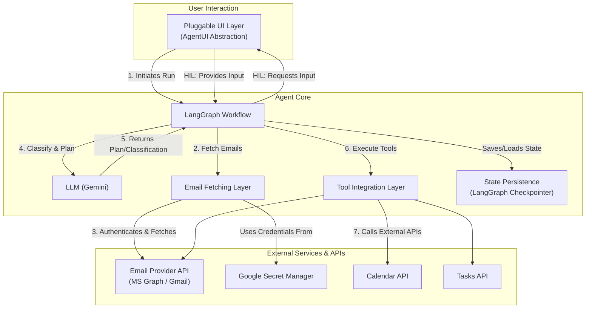

# Email Assistant - Architecture Overview

## Purpose

This document provides a high-level architectural overview of the Email Management Agent. For detailed design specifications, implementation details, and code examples, refer to `email_agent_design.md`.

## What is the Email Assistant?

An intelligent agent that automatically processes emails by:
- Fetching unread emails from Outlook or Gmail
- Classifying and routing emails by type (meetings, tasks, invoices, etc.)
- Taking appropriate actions (creating calendar events, tasks, sending replies)
- Requesting human approval for critical actions
- Providing a summary report of all processed emails

## High-Level Architecture

## Core Design Principles

### 1. Modularity & Extensibility
- **Pluggable UI**: Abstract `AgentUI` interface supports Console, Telegram, or future web interfaces.
- **Provider-Agnostic**: Email fetching abstraction allows easy addition of new providers.
- **Tool Framework**: Simple pattern for adding new capabilities (CRM, webhooks, etc.).

### 2. Intelligent Automation with Control
- **ReAct Pattern**: LLM reasons about actions, executes tools, observes results, and adapts.
- **Human-in-the-Loop**: Critical actions (sending emails, calendar events) require explicit approval.
- **Specialized Routing**: Different email types follow optimized processing paths.

### 3. Batch Processing Efficiency
- Processes multiple emails per run.
- Configurable batch sizes and fetch cycles.
- Message history clearing prevents token overflow.

### 4. Security & Reliability
- All credentials stored in Google Secret Manager.
- OAuth 2.0 with token refresh handling.
- Graceful error handling with user feedback.

## System Components

### 1. User Interface Layer
**What**: Front-end for user interaction.

**Options**:
- **ConsoleUI**: Simple CLI for development/testing.
- **TelegramUI**: Rich chat interface with buttons and markdown.

**Key Features**:
- Display agent messages and progress.
- Request user approval for critical actions.
- Show final batch processing summary.

### 2. Agent Workflow (LangGraph)
**What**: State machine orchestrating email processing.

**Key Stages**:
1. **Fetch**: Retrieve unread emails from provider.
2. **Classify**: Categorize email type (meeting, task, invoice, spam, etc.).
3. **Route**: Send to specialized planner based on classification.
4. **Plan & Execute**: ReAct loop - reason, take actions, repeat until complete.
5. **Approve**: Pause for human approval if needed.
6. **Summarize**: Report all actions taken.

### 3. LLM Brain (Gemini)
**What**: Decision-making engine.

**Responsibilities**:
- Classify emails into categories.
- Plan action sequences.
- Select appropriate tools.
- Generate email replies.
- Extract structured data (dates, amounts, contacts).

### 4. Email Integration
**What**: Connects to email providers.

**Supported Providers**:
- Microsoft Outlook (via MS Graph API)
- Gmail (via Gmail API)

**Capabilities**:
- Fetch unread emails with metadata and body.
- Send emails.
- Archive emails.
- Mark as spam/read.

**Authentication**: OAuth 2.0 with refresh tokens stored in Secret Manager.

### 5. Tool Ecosystem
**What**: External integrations the agent can use.

**Available Tools**:
- **Email Actions**: send, archive, mark_spam
- **Calendar**: create_event, check_availability
- **Tasks**: create_task
- **Human Interaction**: ask_user_for_input

### 6. State Management
**What**: Shared memory across the workflow.

**Key Data**:
- Inbox (batch of emails)
- Current email being processed
- Message history (LLM conversation)
- Classification and extracted data
- User preferences and approval settings
- Run summary (audit trail)

### 7. Configuration & Secrets
**What**: System configuration.

**Configuration Sources**:
- Environment variables (API keys, model selection)
- User preferences (approval rules)
- Google Secret Manager (OAuth credentials, tokens)

## Technology Stack

| Component | Technology |
|-----------|-----------|
| **Agent Framework** | LangGraph (state machine) |
| **LLM Provider** | Google Gemini |
| **Email APIs** | MS Graph (Outlook), Gmail API |
| **Authentication** | MSAL (Microsoft), Google Auth |
| **Secret Management** | Google Secret Manager |
| **Async UI** | python-telegram-bot |
| **Language** | Python 3.11+ |

## Documentation Structure

- `docs/architecture.md` (This Document): High-level overview.
- `docs/email_agent_design.md`: Detailed design (nodes, state, tools).
- `docs/agent_ui_design.md`: UI abstraction details.
- `GEMINI.md`: Project context for the Gemini agent.
