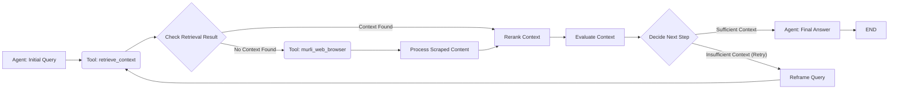

## Question:
So I am using retrieve_context tool to fetch murli contents from chroma vector db. But it might be that user asks a question like "Can you summarize the murli of 1990-01-18" and the murli for that specific date is not present in chromadb. What I want is that LLM should first trigger the retrieve_context tool and check if it is able to return murli context, if the returned context is empty I want the LLM to use another tool, this time a murli_web_browser tool that scrapes the murli content for the specific date from a website. Is it possible to make this tool call when the first tool call doesn't work and if yes how can I implement this in langgraph.

### Cline gemini-2.5-flash-preview-04-17 response:
The user wants to implement a fallback mechanism in their LangGraph agent. Currently, the agent uses a `retrieve_context` tool to fetch information from a Chroma DB. If this tool returns no context (meaning the information isn't in the DB), the user wants the agent to automatically call a different tool, `murli_web_browser`, to scrape the content from a website.

This requires modifying the LangGraph workflow. The current workflow is:
1. `agent_initial`: Handles the initial query and decides if a tool call is needed (currently only `retrieve_context`).
2. `retrieve_context`: Calls the `retrieve_context` tool.
3. `rerank_context`: Reranks the retrieved context.
4. `evaluate_context`: Evaluates if the context is sufficient.
5. `decide_next_step`: Based on evaluation, either goes to `reframe_query` (if insufficient and no retry attempted) or `agent_final_answer` (if sufficient or insufficient after retry).
6. `reframe_query`: Reframes the query and loops back to `retrieve_context`.
7. `agent_final_answer`: Generates the final answer or "cannot find" message.

To implement the fallback, I need to introduce a new node or modify an existing one to check if the `retrieve_context` tool returned empty context. If it did, the graph should then route to a new node that calls the `murli_web_browser` tool.

Here's a possible plan:
1. **Introduce a new node after `retrieve_context`**: This node will check the output of `retrieve_context`.
2. **Conditional edge from the new node**: Based on whether the context is empty or not, this node will route to either:
    - `rerank_context` (if context is not empty, continuing the current flow)
    - A new node for calling `murli_web_browser` (if context is empty).
3. **New node for `murli_web_browser`**: This node will call the `murli_web_browser` tool.
4. **Edge from `murli_web_browser` node**: After scraping, this node should probably route back to `rerank_context` or a similar node to process the newly scraped content as if it were retrieved from the DB.

I need to examine the existing code to see where this check and routing can be best implemented. The `rerank_context_node` already receives the artifact from the `retrieve_context` tool. It checks if the artifact is a list and if it's empty. This seems like a good place to add the conditional logic for the fallback.

So, the revised plan:
1. **Modify `rerank_context_node`**:
    - Check if `retrieved_docs_artifact` is an empty list.
    - If empty, set a state variable (e.g., `context_empty_after_retrieval`) to True.
    - If not empty, proceed with reranking and set `context_empty_after_retrieval` to False.
2. **Modify `decide_next_step`**:
    - This function currently decides based on `evaluation_result` and `retry_attempted`.
    - It needs to also consider the new `context_empty_after_retrieval` state variable.
    - If `context_empty_after_retrieval` is True and `retry_attempted` is False (meaning the first retrieval failed), route to a new `call_web_browser` node.
    - Otherwise, keep the existing logic based on `evaluation_result` and `retry_attempted`.
3. **Add a new node `call_web_browser`**: This node will be responsible for calling the `murli_web_browser` tool. It will need access to the original query or a reframed query to pass to the tool.
4. **Add an edge from `call_web_browser`**: After the web browser tool is called, the output (the scraped content) needs to be processed. It should likely go back to the `rerank_context` node to be treated like retrieved documents.

Let's refine the state updates and routing:
- `agent_initial`: Sets up the initial state, including `original_query`, `current_query`, `retry_attempted=False`, `evaluation_result=None`, `context=None`. Routes to `retrieve_context` via `tools_condition`.
- `retrieve_context`: Calls the tool. The tool's output (status string and list of doc contents) is added to the state's `messages` list as a `ToolMessage` with an `artifact`.
- `rerank_context`: Reads the `artifact` from the last `ToolMessage`.
    - If `artifact` is an empty list: Sets `context_empty_after_retrieval=True`. Sets `context=""`. Returns state.
    - If `artifact` is not empty: Reranks, sets `context` to the concatenated reranked docs. Sets `context_empty_after_retrieval=False`. Returns state.
- `decide_next_step`:
    - Reads `evaluation_result`, `retry_attempted`, and `context_empty_after_retrieval`.
    - If `context_empty_after_retrieval` is True AND `retry_attempted` is False: Return `"call_web_browser"`.
    - If `evaluation_result == "sufficient"`: Return `"agent_final_answer"`.
    - If `evaluation_result == "insufficient"` AND `retry_attempted` is False: Return `"reframe_query"`.
    - If `evaluation_result == "insufficient"` AND `retry_attempted` is True: Return `"agent_final_answer"`.
- `call_web_browser`:
    - Reads `current_query` from state.
    - Calls the `murli_web_browser` tool with the query.
    - The tool's output (scraped content) is added to the state's `messages` as a `ToolMessage` with an `artifact`.
    - Sets `retry_attempted=True` (since this is the fallback attempt).
    - Sets `context_empty_after_retrieval=False` (since we just tried to get context from the web).
    - Routes to `rerank_context` to process the scraped content.
- `reframe_query`: Reads `original_query` and `current_query`. Reframes the query. Creates a new `AIMessage` with a tool call to `retrieve_context` using the reframed query. Sets `current_query` to the reframed query, `retry_attempted=True`, `evaluation_result=None`, `context=None`. Routes to `retrieve_context`.
- `agent_final_answer`: Reads `evaluation_result`, `original_query`, and `context`. Generates the final answer or "cannot find" message. Routes to `END`.

This plan seems sound. It introduces a new node and modifies the conditional logic to handle the fallback scenario. The scraped content is then fed back into the reranking/evaluation pipeline, which is efficient.

I will need to:
1. Define the `murli_web_browser` tool (or assume it exists and is added to `available_tools`).
2. Add the `call_web_browser` node to the graph builder.
3. Modify the `decide_next_step` function to include the new conditional logic.
4. Modify the `rerank_context_node` to set the `context_empty_after_retrieval` state variable.
5. Add the necessary edges in `graph_builder`.

I will start by outlining the plan using `plan_mode_respond`. I will explain the proposed changes to the graph structure and the logic. I will also mention the need for the `murli_web_browser` tool to be available.Okay, I understand the requirement. You want to implement a fallback mechanism in your LangGraph agent where if the initial `retrieve_context` tool call returns no relevant documents, a second tool, `murli_web_browser`, is called to scrape the content from a website.

This is a common pattern in RAG systems to handle cases where the primary knowledge source (your Chroma DB) doesn't contain the necessary information.

Here's a plan to implement this in your LangGraph agent:

**Proposed Graph Structure Changes:**

We will introduce a new node and modify the conditional logic to handle the fallback. The updated flow will look something like this:

**Detailed Steps:**

1.  **Introduce a `check_retrieval_result` Node (or modify `rerank_context_node`):**
    *   The `rerank_context_node` already receives the output (artifact) from the `retrieve_context` tool. It checks if the artifact is a list and if it's empty. This node is a suitable place to add the logic for checking if the initial retrieval was successful.
    *   Modify `rerank_context_node` to set a state variable (e.g., `retrieval_successful`) to `True` if documents were retrieved and `False` if the artifact was empty. It should also pass the retrieved documents (or an empty list) along in the state.

2.  **Modify the `decide_next_step` Function:**
    *   This function currently decides whether to reframe the query or generate the final answer based on the `evaluation_result` and `retry_attempted` state variables.
    *   We need to update this function to also consider the `retrieval_successful` state variable set in the previous step.
    *   If `retrieval_successful` is `False` and `retry_attempted` is `False` (meaning the initial retrieval failed), the function should return a new route name, for example, `"call_web_browser"`.
    *   Otherwise, the existing logic based on `evaluation_result` and `retry_attempted` will apply.

3.  **Add a New Node `call_web_browser`:**
    *   This node will be responsible for invoking the `murli_web_browser` tool.
    *   It will need access to the user's query (likely the `current_query` from the state) to pass as an argument to the web scraping tool.
    *   After the `murli_web_browser` tool is called, its output (the scraped content) will be added to the state's `messages` list as a `ToolMessage` with an `artifact`.
    *   This node should also update the state to indicate that a retry has been attempted (set `retry_attempted` to `True`) and reset `retrieval_successful` to `True` (assuming the web scraping tool will return content if available).

4.  **Add a `process_scraped_content` Node (Optional but Recommended):**
    *   The output of the `murli_web_browser` tool will be raw text. It's beneficial to process this text similarly to how you process documents loaded from your data directory (e.g., potentially chunking it if it's very long).
    *   This node would take the scraped content from the state, process it into a format similar to your `Document` objects (or just a list of strings), and add it to the state in a way that the `rerank_context_node` can handle it.

5.  **Update `graph_builder.py`:**
    *   Add the `murli_web_browser` tool to the `available_tools` list. You will need to have this tool defined and imported.
    *   Add the new nodes (`call_web_browser` and `process_scraped_content` if you choose to add it) to the graph builder.
    *   Define the new edges:
        *   From `retrieve_context` to `check_retrieval_result` (or modify the edge from `retrieve_context` to `rerank_context` to be conditional based on the check within `rerank_context_node`).
        *   Conditional edges from `check_retrieval_result` (or the modified `rerank_context_node`) to `rerank_context` or `call_web_browser`.
        *   An edge from `call_web_browser` to `process_scraped_content` (if added).
        *   An edge from `process_scraped_content` to `rerank_context`.

**Implementation Details:**

*   **State Management:** Ensure your `AgentState` includes the necessary keys like `retrieval_successful` and potentially a place to store the raw scraped content before processing.
*   **Tool Definition:** You will need a Python function or class decorated with `@tool` that encapsulates the logic for scraping the murli content from the website. This tool should take the date and potentially language as input and return the scraped text.
*   **Error Handling:** Consider how to handle potential errors during web scraping (e.g., website is down, content not found for the date). The `call_web_browser` node should ideally update the state in a way that prevents infinite loops and allows the agent to proceed to the "cannot find" message if both retrieval and scraping fail.

This approach allows you to seamlessly integrate the web scraping fallback into your existing LangGraph agent flow. The agent will first try the efficient vector database lookup and only resort to the potentially slower web scraping if necessary.

Does this plan make sense? Are there any specific parts you'd like to discuss in more detail, or would you like me to proceed with outlining the code modifications based on this plan?

Okay, I apologize for not using the correct tool in my previous response. In PLAN MODE, I should use the `plan_mode_respond` tool to communicate the plan.

To implement the fallback mechanism where the agent calls a `murli_web_browser` tool if the initial `retrieve_context` tool returns no context, we will modify the LangGraph structure as follows:

**Proposed Graph Structure Changes:**

**Detailed Steps:**

1.  **Modify `rerank_context_node`:** Update this node to check if the `artifact` received from `retrieve_context` is an empty list. Set a state variable (`retrieval_successful`) to `False` if empty, `True` otherwise.
2.  **Modify the `decide_next_step` Function:** Update this function to check the `retrieval_successful` state variable. If it's `False` and `retry_attempted` is `False`, route to a new node `"call_web_browser"`. Otherwise, follow the existing logic.
3.  **Add a New Node `call_web_browser`:** This node will call the `murli_web_browser` tool with the `current_query`. It will set `retry_attempted` to `True` and route to a node that processes the scraped content.
4.  **Add a `process_scraped_content` Node (Recommended):** This node will take the raw scraped text, potentially chunk it, and format it so it can be processed by the `rerank_context` node. It will then route to `rerank_context`.
5.  **Update `graph_builder.py`:** Add the `murli_web_browser` tool to `available_tools`, add the new nodes (`call_web_browser` and `process_scraped_content`), and define the new conditional edges.

This plan introduces the necessary logic and nodes to implement the fallback mechanism. We will need to ensure the `murli_web_browser` tool is defined and available.

Does this plan align with what you had in mind? Once we agree on the plan, you can switch me to ACT MODE to implement the code changes.

### Question 2: 