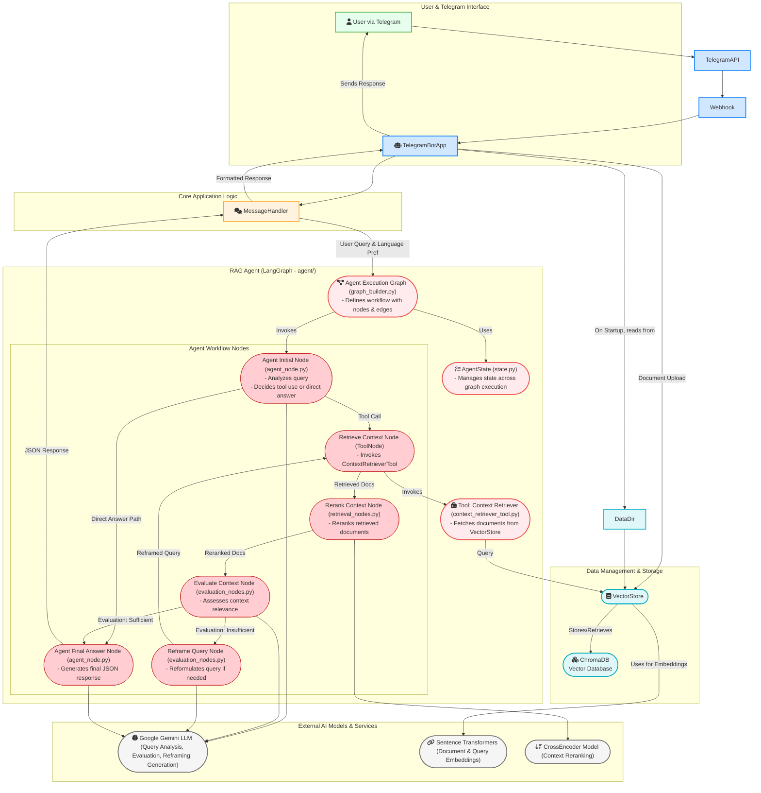

```mermaid

graph TD

    %% ----- User & Telegram Interface -----

    subgraph "User & Telegram Interface"

        direction LR

        User["fa:fa-user User via Telegram"]        

        TelegramBotApp["fa:fa-robot TelegramBotApp"]

    end

  

    %% ----- Core Application Logic -----

    subgraph "Core Application Logic"

        direction LR

        MessageHandler["fa:fa-comments MessageHandler"]        

    end

  

    %% ----- RAG Agent (LangGraph) -----

    subgraph "RAG Agent (LangGraph - agent/)"

        direction LR

        AgentOrchestrator(["fa:fa-project-diagram Agent Execution Graph (graph_builder.py)\n- Defines workflow with nodes & edges"])

        subgraph "Agent Workflow Nodes"

            direction LR

            Node_AgentInitial(["Agent Initial Node (agent_node.py)\n- Analyzes query\n- Decides tool use or direct answer"])

            Node_RetrieveContext(["Retrieve Context Node (ToolNode)\n- Invokes ContextRetrieverTool"])

            Node_RerankContext(["Rerank Context Node (retrieval_nodes.py)\n- Reranks retrieved documents"])

            Node_EvaluateContext(["Evaluate Context Node (evaluation_nodes.py)\n- Assesses context relevance"])

            Node_ReframeQuery(["Reframe Query Node (evaluation_nodes.py)\n- Reformulates query if needed"])

            Node_AgentFinalAnswer(["Agent Final Answer Node (agent_node.py)\n- Generates final JSON response"])

        end

        ContextRetrieverTool(["fa:fa-toolbox Tool: Context Retriever (context_retriever_tool.py)\n- Fetches documents from VectorStore"])

        AgentState(["fa:fa-tasks AgentState (state.py)\n- Manages state across graph execution"])

    end

  

    %% ----- Data Management & Storage -----

    subgraph "Data Management & Storage"

        direction LR

        VectorStoreManager(["fa:fa-database VectorStore"])

        ChromaDB(["fa:fa-cubes ChromaDB\nVector Database"])        

    end

  

    %% ----- External AI Models & Services -----

    subgraph "External AI Models & Services"

        direction LR

        GeminiLLM(["fa:fa-brain Google Gemini LLM (Query Analysis, Evaluation, Reframing, Generation)"])

        EmbeddingModel(["fa:fa-link Sentence Transformers (Document & Query Embeddings)"])

        RerankerModel(["fa:fa-sort-amount-down CrossEncoder Model (Context Reranking)"])

    end

  

    %% ----- Connections -----

  

    %% User Flow

    User --> TelegramAPI

    TelegramAPI --> Webhook

    Webhook --> TelegramBotApp

  

    %% Bot App to Core Logic & Data

    TelegramBotApp --> MessageHandler    

    TelegramBotApp -- Document Upload --> VectorStoreManager    

    TelegramBotApp -- On Startup, reads from --> DataDir --> VectorStoreManager

  

    %% Message Handler to Agent

    MessageHandler -- User Query & Language Pref --> AgentOrchestrator

    AgentOrchestrator -- Uses --> AgentState

  

    %% Agent Orchestrator and Nodes

    AgentOrchestrator -- Invokes --> Node_AgentInitial

    Node_AgentInitial -- Tool Call --> Node_RetrieveContext

    Node_AgentInitial -- Direct Answer Path --> Node_AgentFinalAnswer

    Node_RetrieveContext -- Invokes --> ContextRetrieverTool

    Node_RetrieveContext -- Retrieved Docs --> Node_RerankContext

    Node_RerankContext -- Reranked Docs --> Node_EvaluateContext

    Node_EvaluateContext -- Evaluation: Sufficient --> Node_AgentFinalAnswer

    Node_EvaluateContext -- Evaluation: Insufficient --> Node_ReframeQuery

    Node_ReframeQuery -- Reframed Query --> Node_RetrieveContext

    Node_AgentFinalAnswer -- JSON Response --> MessageHandler

    MessageHandler -- Formatted Response --> TelegramBotApp

    TelegramBotApp -- Sends Response --> User

  

    %% Agent Nodes to External Models

    Node_AgentInitial --> GeminiLLM

    Node_EvaluateContext --> GeminiLLM

    Node_ReframeQuery --> GeminiLLM

    Node_AgentFinalAnswer --> GeminiLLM

    Node_RerankContext --> RerankerModel

    %% Context Retriever Tool to VectorStore

    ContextRetrieverTool -- Query --> VectorStoreManager

  

    %% VectorStore Manager Interactions

    VectorStoreManager -- Stores/Retrieves --> ChromaDB

    VectorStoreManager -- Uses for Embeddings --> EmbeddingModel

  

    %% Styling (FontAwesome icons for better visuals if supported by renderer)

    classDef default fill:#ECECFF,stroke:#999,stroke-width:1px,color:#333,font-family:Helvetica

    classDef user fill:#E6FFED,stroke:#4CAF50,stroke-width:2px

    classDef telegram fill:#D1E7FF,stroke:#007BFF,stroke-width:2px

    classDef core fill:#FFF3E0,stroke:#FFA726,stroke-width:2px

    classDef agent fill:#FFEBEE,stroke:#EF5350,stroke-width:2px

    classDef agentnode fill:#FFCDD2,stroke:#C62828,stroke-width:1px

    classDef data fill:#E0F7FA,stroke:#00ACC1,stroke-width:2px

    classDef external fill:#F5F5F5,stroke:#757575,stroke-width:2px

  

    class User user;

    class TelegramAPI,Webhook,TelegramBotApp telegram;

    class MessageHandler,Config,Logger core;

    class AgentOrchestrator,ContextRetrieverTool,AgentState agent;

    class Node_AgentInitial,Node_RetrieveContext,Node_RerankContext,Node_EvaluateContext,Node_ReframeQuery,Node_AgentFinalAnswer agentnode;

    class VectorStoreManager,ChromaDB,DataDir,UploadsDir data;

    class GeminiLLM,EmbeddingModel,RerankerModel external;

```
