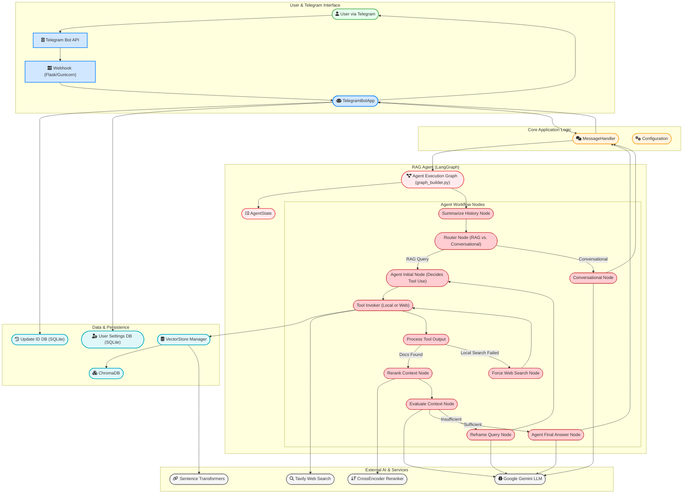

```mermaid
graph TD
    %% ----- User & Telegram Interface -----
    subgraph "User & Telegram Interface"
        User(["fa:fa-user User via Telegram"])
        TelegramAPI["fa:fa-telegram Telegram Bot API"]
        Webhook["fa:fa-server Webhook (Flask/Gunicorn)"]
        TelegramBotApp(["fa:fa-robot TelegramBotApp"])
    end

    %% ----- Core Application Logic -----
    subgraph "Core Application Logic"
        MessageHandler(["fa:fa-comments MessageHandler"])
        Config(["fa:fa-cogs Configuration"])
    end

    %% ----- RAG Agent (LangGraph) -----
    subgraph "RAG Agent (LangGraph)"
        AgentOrchestrator(["fa:fa-project-diagram Agent Execution Graph (graph_builder.py)"])
        AgentState(["fa:fa-tasks AgentState"])

        subgraph "Agent Workflow Nodes"
            Node_Summarize(["Summarize History Node"])
            Node_Router(["Router Node (RAG vs. Conversational)"])
            Node_Conversational(["Conversational Node"])
            Node_AgentInitial(["Agent Initial Node (Decides Tool Use)"])
            Node_ToolInvoker(["Tool Invoker (Local or Web)"])
            Node_ProcessOutput(["Process Tool Output"])
            Node_RerankContext(["Rerank Context Node"])
            Node_EvaluateContext(["Evaluate Context Node"])
            Node_ReframeQuery(["Reframe Query Node"])
            Node_ForceWebSearch(["Force Web Search Node"])
            Node_AgentFinalAnswer(["Agent Final Answer Node"])
        end
    end

    %% ----- Data Management & Storage -----
    subgraph "Data & Persistence"
        VectorStoreManager(["fa:fa-database VectorStore Manager"])
        ChromaDB(["fa:fa-cubes ChromaDB"])
        UserSettingsManager(["fa:fa-user-cog User Settings DB (SQLite)"])
        UpdateManager(["fa:fa-history Update ID DB (SQLite)"])
    end

    %% ----- External AI Models & Services -----
    subgraph "External AI & Services"
        GeminiLLM(["fa:fa-brain Google Gemini LLM"])
        EmbeddingModel(["fa:fa-link Sentence Transformers"])
        RerankerModel(["fa:fa-sort-amount-down CrossEncoder Reranker"])
        Tavily(["fa:fa-search Tavily Web Search"])
    end

    %% ----- Connections -----

    %% User Input Flow
    User --> TelegramAPI
    TelegramAPI --> Webhook
    Webhook --> TelegramBotApp
    TelegramBotApp --> UpdateManager
    TelegramBotApp --> UserSettingsManager
    TelegramBotApp --> MessageHandler

    %% Agent Invocation & Routing
    MessageHandler --> AgentOrchestrator
    AgentOrchestrator --> AgentState
    AgentOrchestrator --> Node_Summarize
    Node_Summarize --> Node_Router
    Node_Router -->|RAG Query| Node_AgentInitial
    Node_Router -->|Conversational| Node_Conversational

    %% Conversational Path
    Node_Conversational --> GeminiLLM
    Node_Conversational --> MessageHandler

    %% RAG Path
    Node_AgentInitial --> Node_ToolInvoker
    Node_ToolInvoker --> VectorStoreManager
    Node_ToolInvoker --> Tavily
    Node_ToolInvoker --> Node_ProcessOutput
    Node_ProcessOutput -->|Docs Found| Node_RerankContext
    Node_ProcessOutput -->|Local Search Failed| Node_ForceWebSearch
    Node_ForceWebSearch --> Node_ToolInvoker
    Node_RerankContext --> RerankerModel
    Node_RerankContext --> Node_EvaluateContext
    Node_EvaluateContext --> GeminiLLM
    Node_EvaluateContext -->|Sufficient| Node_AgentFinalAnswer
    Node_EvaluateContext -->|Insufficient| Node_ReframeQuery
    Node_ReframeQuery --> GeminiLLM
    Node_ReframeQuery --> Node_AgentInitial
    Node_AgentFinalAnswer --> GeminiLLM
    Node_AgentFinalAnswer --> MessageHandler

    %% Final Output Flow
    MessageHandler --> TelegramBotApp
    TelegramBotApp --> User

    %% Data & Model Connections
    VectorStoreManager --> ChromaDB
    VectorStoreManager --> EmbeddingModel

    %% Styling
    classDef default fill:#ECECFF,stroke:#999,stroke-width:1px,color:#333
    classDef user fill:#E6FFED,stroke:#4CAF50,stroke-width:2px
    classDef telegram fill:#D1E7FF,stroke:#007BFF,stroke-width:2px
    classDef core fill:#FFF3E0,stroke:#FFA726,stroke-width:2px
    classDef agent fill:#FFEBEE,stroke:#EF5350,stroke-width:2px
    classDef agentnode fill:#FFCDD2,stroke:#C62828,stroke-width:1px
    classDef data fill:#E0F7FA,stroke:#00ACC1,stroke-width:2px
    classDef external fill:#F5F5F5,stroke:#757575,stroke-width:2px

    class User user
    class TelegramAPI,Webhook,TelegramBotApp telegram
    class MessageHandler,Config core
    class AgentOrchestrator,AgentState agent
    class Node_Summarize,Node_Router,Node_Conversational,Node_AgentInitial,Node_ToolInvoker,Node_ProcessOutput,Node_RerankContext,Node_EvaluateContext,Node_ReframeQuery,Node_ForceWebSearch,Node_AgentFinalAnswer agentnode
    class VectorStoreManager,ChromaDB,UserSettingsManager,UpdateManager data
    class GeminiLLM,EmbeddingModel,RerankerModel,Tavily external
```
